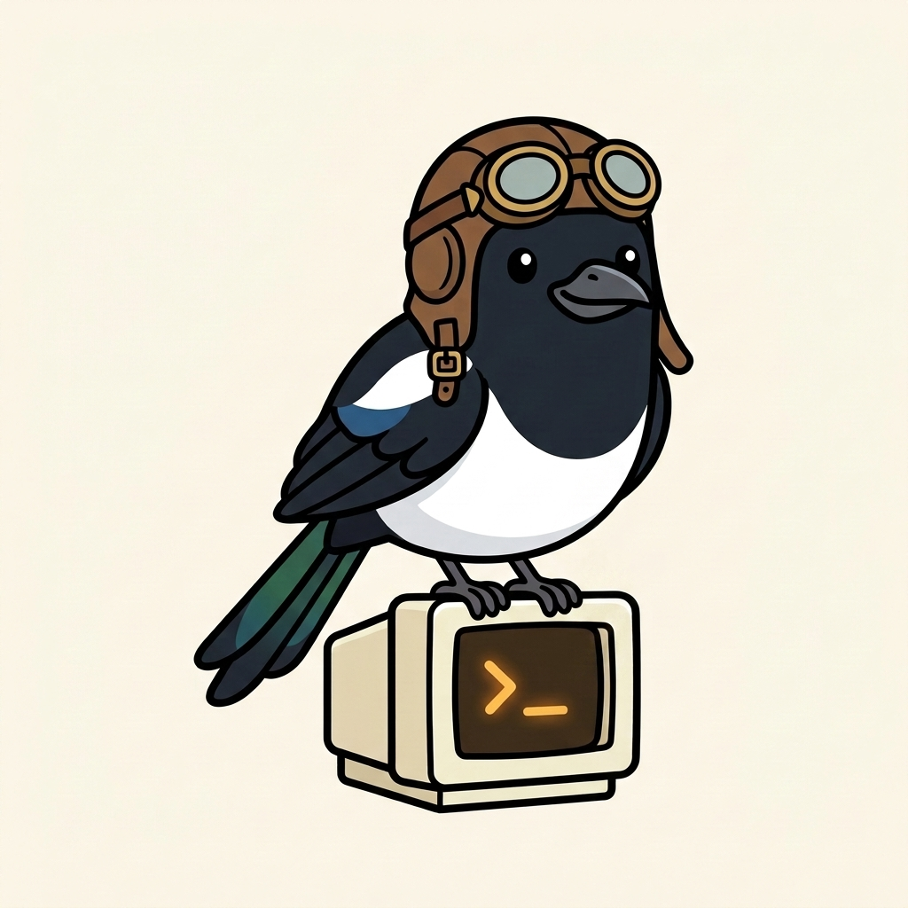

# MagPilot

<p align="center">
  
</p>

> Bring the GitHub Copilot CLI experience to your phone.

`magpilot` is a small system that lets you drive `copilot` (the GitHub
Copilot CLI) from your phone, against any of your computers, over your
home VPN.

It is **not** another agent platform. It does not have plugins, cron
jobs, web dashboards, or a smart-home integration. (For that, see
[openclaw](https://github.com/openclaw/openclaw).) MagPilot's only
goal is "I want a chat client on my phone that talks to Copilot CLI
running on one of my real computers."

---

## Why

Chris's setup:

- A workstation (HENDRIK), a Mac, and a few other machines, each with
  GitHub Copilot CLI installed and authenticated.
- A WireGuard VPN that lets the phone reach the home LAN from anywhere.
- A docker LXC at `192.168.1.239` that already runs always-on services.

What he wants from his phone:

1. A chat UI that connects to a real `copilot` process on a chosen
   host, with the **full agent capability** — tool calls, file edits,
   shell commands, MCP servers.
2. The ability to **see all sessions across all machines**, including
   ones currently running in a terminal somewhere.
3. The ability to **take over** an in-progress terminal session
   (kill it, resume under our control) so a chat started at the desk
   can be continued from the couch.
4. Approval prompts (for risky tools) that show up as proper modals
   on the phone, not blanket allow-all.
5. Push notifications when an agent finishes a long-running task or
   needs an answer while the app is backgrounded.

## How (one paragraph)

A small **per-host agent** daemon runs on each computer. It speaks
the [Agent Client Protocol (ACP)](https://agentclientprotocol.com/)
to a single `copilot --acp --port <N>` child, which gives us
JSON-RPC access to the full Copilot CLI agent — first-class
sessions, structured streaming, real per-tool approvals. The agent
exposes a tiny HTTP+SSE API to the LAN.

A central **hub** daemon runs on the docker LXC. It auto-discovers
agents via UDP broadcast, aggregates their sessions, proxies
streams, and is the single endpoint clients talk to. This makes
the WireGuard story simple: one address (`https://magpilot.home.sienkiewi.cz`)
forever, hub deals with finding and routing to the actual hosts.

Two clients consume the hub's API and share **a single Blazor UI
codebase** (MAUI Blazor Hybrid):

- A **.NET MAUI Android app** on the Pixel that hosts the Blazor UI
  in a WebView. Bearer-token auth, FCM push.
- A **Blazor WebAssembly SPA** at `https://magpilot.home.sienkiewi.cz`
  for any browser. GitHub OAuth login (allowlisted to a single user),
  Web Push notifications.

## Components

| Name              | What                                                     | Where it runs              |
|-------------------|----------------------------------------------------------|----------------------------|
| `Magpilot.Agent`  | ACP-to-HTTP/SSE adapter, one per machine                 | HENDRIK, Linux container, etc. |
| `Magpilot.Hub`    | Aggregator, discovery, OAuth, central log, serves the web SPA | docker LXC (CT 102)   |
| `Magpilot.UI`     | Shared Blazor UI library (chat, sessions, theme)         | Future MAUI WebView + browser |
| `Magpilot.Web`    | Blazor WASM shell for browsers                           | Browser, served by hub     |
| `Magpilot.Shared` | DTOs + SSE wire types (the contract between agent + UI)  | n/a (referenced)           |

## Status

**Live since 2026-04** at `https://magpilot.home.sienkiewi.cz`. The hub
runs on a docker LXC (CT 102), agents on each host (HENDRIK + a Linux
container called `magnus`). Day-to-day usage covers chatting from any
browser, hopping between Owned / Locked / Dormant sessions, full ACP
tool-call streaming, central log viewer at `/admin/logs`.

What is **NOT yet wired**: the MAUI Android shell (the original phone
target), real FCM/Web Push delivery, TLS for hub<->agents (still LAN +
bearer), and approval-prompt modals for risky tool calls. See
`docs/plan.md` for the full roadmap.

## Repository layout

```
magpilot/
   Magpilot.slnx
   docs/plan.md              <- design doc (start here for the long version)
   docs/architecture.md      <- topology + the agent HTTP contract
   .github/copilot-instructions.md  <- orientation for AI agents working on this repo
   spikes/acp-smoke/         <- standalone ACP smoke test
   scripts/build-hub.ps1     <- builds web SPA + copies into hub wwwroot
   src/
      Magpilot.Shared/      <- DTOs, SSE event types
      Magpilot.Agent/       <- per-host daemon (ACP wrapper + HTTP/SSE API)
      Magpilot.Hub/         <- central daemon (proxy, OAuth, SPA host,
                                central /api/log sink + viewer)
      Magpilot.UI/          <- shared Blazor components (chat, sessions,
                                MagpilotTheme, ChatView, HubClient,
                                HubLogClient, JsErrorBridge)
      Magpilot.Web/         <- Blazor WASM shell for the browser
   deploy/                   <- docker-compose + ship-image notes for the hub
```

## Build & run locally

```pwsh
# Build everything
dotnet build

# Run the agent (in one terminal)
$env:MAGPILOT_AGENT_TOKEN = "dev-token"
$env:ASPNETCORE_URLS       = "http://localhost:5099"
dotnet run --project src/Magpilot.Agent

# Build the SPA + copy it into the hub's wwwroot
./scripts/build-hub.ps1

# Run the hub (in another terminal)
$env:MAGPILOT_HUB_BEARER  = "dev-bearer"
$env:MAGPILOT_AGENT_TOKEN = "dev-token"
$env:MAGPILOT_DEV_BYPASS_AUTH = "true"
$env:ASPNETCORE_URLS       = "http://localhost:7088"
dotnet run --project src/Magpilot.Hub

# Open http://localhost:7088/  (web SPA; OAuth bypassed in dev mode)
# Or curl with bearer:
#   curl -H "Authorization: Bearer dev-bearer" http://localhost:7088/api/agents
```

See `deploy/README.md` for the LXC docker recipe.

## Architectural law

> **Satellites know about magpilot. Magpilot does NOT know about satellites.**

If you want magpilot to do something for an external service, the right
answer is almost always a deployment-time bootstrap hook (see
`MAGPILOT_BOOTSTRAP_HOOK_DIR` in `src/Magpilot.Agent/bootstrap.sh`) or a
new HTTP-API consumer, not a magpilot patch. Don't add agent-specific
code paths or hostnames into magpilot itself.

## Related context

- An example **outer-ring deployment** that consumes magpilot as a git
  submodule + adds a personal-assistant product, a WhatsApp bridge, a
  cron sidecar, and a context-loader on top:
  [`chsienki/magstronaut`](https://github.com/chsienki/magstronaut)
  (private; reach out if you'd like to see how it's wired).
- The home-network and openclaw task-context docs for Chris's deployment
  live in a separate repo at `chsienki/copilot-context`.
