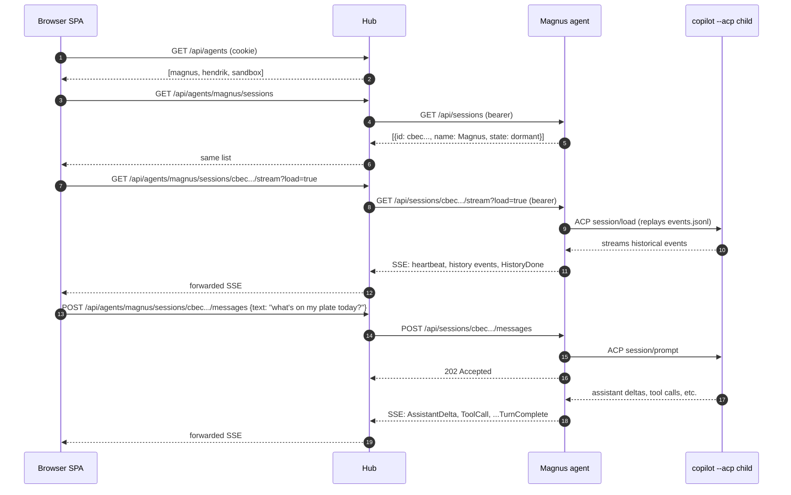
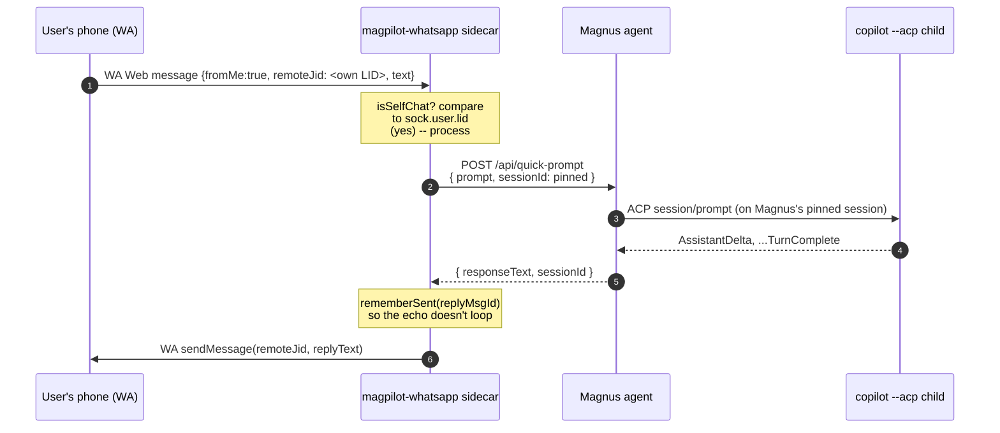
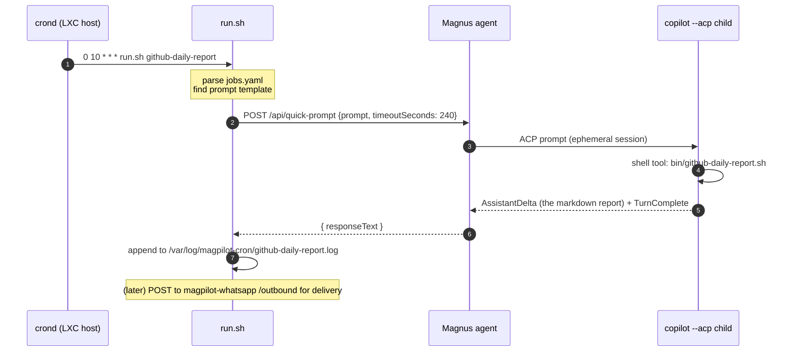

# Magpilot Architecture

> A guided tour of how Magpilot is put together: what each process does, how
> they find each other, how a single user prompt flows through the system,
> and how external sidecars (WhatsApp, cron, Preflight) plug in without the
> hub or agents having to know about them.

## At a glance

```
                        BROWSER / PHONE
                              |
                              | HTTPS (cookie auth)
                              v
                       +---------------+
                       |  Magpilot Hub |     <-- the only thing exposed to NPM/the LAN
                       |  (ASP.NET 9)  |
                       +---------------+
                          ^         ^
                 hub<->agent       hub<->agent
                  HTTP+SSE          HTTP+SSE
        (agent bearer auth)     (agent bearer auth)
                       |        |        |
              +--------+        |        +-----------+
              |                 |                    |
    +-------------------+ +-------------------+ +-------------------+
    | HENDRIK agent     | | SANDBOX agent     | | Magnus agent      |
    | (Win, dev box)    | | (Win VM)          | | (LXC 102, Linux)  |
    | spawns copilot.exe| | spawns copilot.exe| | spawns copilot    |
    | (and agency.exe)  | | (default flavor)  | | (always-on        |
    |                   | |                   | |  pinned session)  |
    +-------------------+ +-------------------+ +-------------------+
              ^                                          ^
              |                                          |
        UDP discovery                                    | direct HTTP
        broadcast 47823                                  | (agent bearer)
                                                         |
                                            +------------+------------+
                                            |                         |
                                  +-------------------+   +-------------------+
                                  | magpilot-cron     |   | magpilot-whatsapp |
                                  | (host crond +     |   | (Node + Baileys   |
                                  |  bash script)     |   |  + Fastify)       |
                                  +-------------------+   +-------------------+
                                                                  ^
                                                                  | WA Web protocol
                                                                  | (Signal-style E2EE)
                                                                  v
                                                              WHATSAPP
```

Key shapes to keep in mind:

- **One Hub, many Agents.** The hub doesn't run Copilot — agents do. The hub
  is the user-facing front door (browser SPA, REST/SSE, identity).
- **Sidecars talk to the agent's HTTP API directly.** They don't reach into
  the hub, and they aren't known to the hub. (Cron and WhatsApp both live on
  LXC 102 next to Magnus, so "talk directly to :5099" means localhost.)
- **The SPA is the only client that goes through the hub** for per-agent
  data. Service callers (cron, WA) bypass the hub by talking to a specific
  agent they were configured for.

## The processes, in detail

### Magpilot Hub (`Magpilot.Hub`)

ASP.NET 9 Web app. Single container at `/srv/magpilot/`, host networking,
port 7088 behind Nginx Proxy Manager (`magpilot.home.sienkiewi.cz`).

Responsibilities:

- Serves the **Blazor WebAssembly SPA** (the wwwroot is built into the hub
  image at compile time -- no separate static-host needed).
- Holds the **agent registry**: a list of online agents with their URL,
  bearer token, capability flavors, and last-heartbeat timestamp. Lives
  in-memory; rebuilt from UDP discovery + manual `/api/agents` POSTs.
- Performs **agent discovery** every N seconds: broadcasts a UDP probe on
  port 47823. Online agents reply with `{name, url, flavors}`. Cross-subnet
  hosts (Sandbox VM on a WireGuard /32) don't get the broadcast and are
  registered manually.
- **Proxies** SPA-initiated calls to the right agent: browser hits
  `https://magpilot.../api/agents/magnus/sessions`, hub looks up `magnus`
  in the registry, forwards the call with the agent bearer token.
- **Three named HttpClients per agent** (`agent`, `agent-action`,
  `agent-stream`) registered in `Program.cs` and dispensed by
  `AgentHttpClient.ClientFor(name, kind)`:

  | Kind                       | Timeout       | Used for                                                                                        |
  |----------------------------|---------------|-------------------------------------------------------------------------------------------------|
  | `AgentClientKind.Read`     | 10s (default) | Control-plane GETs (registry, sessions list, host state). Fail-fast so a dead agent can't stall SPA aggregation. |
  | `AgentClientKind.Action`   | 90s (default) | ACP-driving mutations: `POST /sessions`, `POST /sessions/{id}/adopt`. ACP can spend ~5-30s loading plugins; under 10s the hub returned 502 and marked the agent OFFLINE despite it being healthy. |
  | `AgentClientKind.Stream`   | infinite      | SSE proxy + `quick-prompt` (long-poll service caller).                                          |

  Tunable via `Hub:AgentHttpTimeoutSec` and `Hub:AgentActionTimeoutSec`.
  **Regression rule:** any new mutating endpoint must request `Action`;
  fire-and-forget routes like `/messages` (which return 202 immediately)
  can stay on `Read`.
- **OAuth** for browser users (GitHub OAuth, allowlisted username; or
  `MAGPILOT_DEV_BYPASS_AUTH=true` for `/dev-login`). Cookie auth.

The hub does **not** know about cron jobs, WhatsApp, or Preflight. Those
are external clients of the agent API.

### Magpilot Agent (`Magpilot.Agent`)

ASP.NET 9 Web app, one per host (HENDRIK, SANDBOX, Magnus). Listens on
TCP 5099 + UDP 47823.

Responsibilities:

- Owns the **ACP child process(es)** -- usually `copilot --acp` (Linux
  binary or `copilot.exe`), optionally `agency.exe` for the agency flavor
  on Windows hosts.
- Maintains **sessions**: maps a Magpilot session id to an ACP session id
  and a CWD. State persists in `~/.copilot/session-state/` (events.jsonl
  per session). Adopts dormant sessions on demand when the SPA opens one.
- Serves the **agent HTTP API** (see below). Bearer-auth protected
  with `MAGPILOT_AGENT_TOKEN` (shared secret with the hub).
- Replies to UDP discovery probes with name + URL + flavors.

The agent process does **not** speak to the LLM directly. It speaks ACP
(Agent Client Protocol -- a JSON-RPC-over-stdio protocol) to a child
`copilot` process, which in turn calls the GitHub Copilot API.

### Copilot CLI (the ACP child)

Each agent spawns one (or more) long-running `copilot --acp` subprocesses.
ACP is a multi-session protocol -- one process can host many independent
conversations -- so the "default" flavor uses a single shared child.
"Agency" flavor on Windows spawns one child per session because agency's
session multiplexing isn't reliable.

The Copilot CLI authenticates with GitHub on its own (device flow, or
`COPILOT_GITHUB_TOKEN` env). It runs the conversations, calls tools,
writes/reads files, talks to MCP servers.

### Sidecars (cron, WhatsApp, Preflight)

Each sidecar is a separate process/container. They speak only to the
**agent HTTP API** (or, for Preflight, to the **hub HTTP API**). They are
stateless in terms of agent state -- the agent is still the single source
of truth for session state, cwd, ACP wiring, etc.

A sidecar plugs in by knowing:

1. The URL of the target agent (e.g. `http://127.0.0.1:5099` for things
   on LXC 102 next to Magnus).
2. The agent bearer token (`MAGPILOT_AGENT_TOKEN`).
3. (Optionally) a pinned session id, so calls accumulate context across
   invocations instead of starting a fresh conversation each time.

### Magpilot Host (`Magpilot.Host`, the launcher)

Console binary at `src/Magpilot.Host/`, assembly name `magpilot` (i.e.
ships as `magpilot.exe`). Installed on developer machines as
`magpilot` on PATH. **Does NOT shadow `copilot`** -- the user invokes
the launcher explicitly with `magpilot [args]`; the real `copilot`
binary stays as it is. The launcher:

1. Parses `--magpilot-*` flags (take, force, no-take, skip-check,
   exit-on-handoff, status, help) and strips them before forwarding.
2. Pings the agent. If unreachable, emits one warning and exec's the
   real `copilot` binary as a transparent passthrough.
3. For an explicit `--resume=<sid>`: calls `GET /sessions/{id}/state`.
   If the session is currently agent-owned (or held by another local
   process), it prints an interactive Y/n/f/d take-over prompt
   (auto-answered by the `--magpilot-*` flags or refused on non-TTY).
4. On accept: `POST /acquire-for-host`, then spawns the real
   `copilot --resume=<sid>` inside a real PTY (via `sch.pty.net`).
   Bidirectional byte pump between the user's terminal (in raw mode)
   and the PTY master; window-resize watcher.
5. Subscribes to the session's SSE stream. On `release_requested`:
   writes `/exit\r` to the PTY master so copilot shuts down cleanly
   (3s grace, 1s on Force, then `PTY.Kill`), prints a banner, calls
   `POST /release`, and either exits (with `--magpilot-exit-on-handoff`)
   or sits on a "Press <enter> to take it back" prompt.

Single-owner invariant by construction: while the wrapper holds a
session, the agent's `/messages`/`/interrupt`/`/approvals` endpoints
return 409 to the SPA + WhatsApp + cron, so `events.jsonl` never forks.

## Auth model

There are two unrelated auth boundaries:

```
+-----------+   GitHub OAuth   +-----+   bearer token   +-------+
| BROWSER   | ---------------> | HUB | ---------------> | AGENT |
| (cookies) |                  +-----+                  +-------+
+-----------+                                             ^
                                                          |
                                            +------------+
                                            |
                                      +-----------+   bearer token
                                      | SIDECARS  | -----------------+
                                      | (cron, WA)|                  |
                                      +-----------+                  |
                                                                     v
                                                                    AGENT
                                                                  (same one)
```

- **User -> Hub**: GitHub OAuth, username allowlist, cookie session.
  (Or `dev-login` shortcut if `MAGPILOT_DEV_BYPASS_AUTH=true`.)
- **Hub -> Agent**: shared bearer token `MAGPILOT_AGENT_TOKEN`.
- **Sidecar -> Agent**: same shared bearer token. Sidecars don't have a
  per-service token today; they get the same secret because they only run
  on hosts I trust (LXC 102).

Note: the Hub's `/api` endpoints **require browser cookie auth**. Service
callers can't talk to the hub. That's by design -- it forces sidecars to
declare which agent they target rather than punching through the hub.

## The agent HTTP API (the public contract)

All routes are under `/api`, all protected by `Authorization: Bearer <MAGPILOT_AGENT_TOKEN>`
**except** the two version endpoints (`/version`, `/version/latest`),
which are deliberately unauthenticated so the launcher's banner check
works without a configured token.

| Method | Path                                       | What it does                                              |
|---|---|---|
| GET    | `/version`                                 | Agent's own `{version, protocolVersion}`. **No auth.** Used by `magpilot --magpilot-version` and external probes. |
| GET    | `/version/latest`                          | Hub-reported latest release (cached locally by `UpdatePoller`). **No auth.** Drives the launcher's upgrade banner + `--magpilot-update`. |
| GET    | `/info`                                    | Agent name, OS, available flavors                          |
| GET    | `/sessions`                                | List sessions on disk (with state, cwd, last-touched)      |
| POST   | `/sessions`                                | Create a new session                                       |
| GET    | `/sessions/{id}`                           | Get session metadata                                       |
| GET    | `/sessions/{id}/state`                     | Rich ownership + activity view (see "Cooperative single-owner handoff" below). Returns `SessionStateInfo`. **NEW (shim Phase 1).** |
| POST   | `/sessions/{id}/adopt`                     | Bring a dormant session live (re-attach the ACP child)     |
| POST   | `/sessions/{id}/detach`                    | Detach without deleting on-disk state                      |
| POST   | `/sessions/{id}/messages`                  | Send a prompt; returns 202; SSE delivers the reply. **Returns 409** + `HostOwnedResponse` when a magpilot launcher holds the session (see handoff section). |
| GET    | `/sessions/{id}/stream`                    | SSE stream of session events (deltas, tool calls, etc.)    |
| POST   | `/sessions/{id}/interrupt`                 | Cancel the in-flight turn. **Returns 409** when host-owned. |
| POST   | `/sessions/{id}/approvals/{approvalId}`    | Resolve an approval prompt. **Returns 409** when host-owned. |
| POST   | `/sessions/{id}/release-request`           | Broadcast `release_requested` SSE event to subscribers (e.g. a magpilot launcher) so they can begin graceful shutdown. **NEW (shim Phase 1).** |
| POST   | `/sessions/{id}/acquire-for-host`          | Atomic combined op: agent waits for clean turn boundary (or aborts in-flight if `force=true`), drops its lock, marks the session host-owned. **NEW (shim Phase 1).** |
| POST   | `/sessions/{id}/release`                   | Wrapper signals it has shut down its child; agent re-adopts. 409 if wrong `hostPid`. **NEW (shim Phase 1).** |
| POST   | `/quick-prompt`                            | Synchronous "ask + answer" -- handles SSE internally       |

### `quick-prompt` -- the convenience door for non-SPA clients

```
                     POST /api/quick-prompt
                     { prompt, [sessionId], [timeoutSeconds] }
   sidecar  ------------------------------------------------>  agent
                                                                  |
                                                              if sessionId:
                                                                adopt + use it
                                                              else:
                                                                create ephemeral
                                                                  |
                                                              subscribe to ACP
                                                                  |
                                                              send prompt
                                                                  |
                                                              accumulate deltas
                                                              until TurnComplete
                                                                  |
                                                              if ephemeral:
                                                                detach
   sidecar  <------------------------------------------------  agent
                  { responseText, stopReason, sessionId }
```

This is the API the WhatsApp sidecar and cron runner use. One HTTP call
in, the assistant's full reply text out. No SSE consumer code needed.

The optional `sessionId` field is the difference between "every WA
message is its own little fresh chat" (no sessionId) and "every WA
message goes into Magnus's pinned long-running conversation" (sessionId
pinned to Magnus's well-known session id).

## Sessions: ephemeral vs pinned

```
                 +------------+           +------------+
   create ----->|  CREATED   |---adopt-->|   ACTIVE   |---detach--+
                +------------+           +------------+           |
                                              ^   |               |
                                              |   | (copilot      |
                                          adopt   |  process      |
                                              |   v  exits/kills) |
                                          +------------+          |
                                          |  DORMANT   |<---------+
                                          | (events.   |
                                          |  jsonl on  |
                                          |  disk)     |
                                          +------------+
```

- **Ephemeral session**: created by `quick-prompt` without a `sessionId`,
  used for one turn, then detached. The `events.jsonl` stays on disk
  forever (you can later replay it in the SPA), but no live ACP subscription
  exists.
- **Pinned session**: a long-lived session you `/sessions/{id}/adopt` once
  and then keep using. This is what the SPA does for any session you
  explicitly open. Magnus has exactly one of these, created by his
  bootstrap script and recorded at `/home/magnus/.magnus/.session-id` so
  the bootstrap is idempotent across container restarts.

Magpilot's adopt-on-demand logic means even a dormant session can be
re-activated lazily: any operation on it (POST /messages, GET /stream)
triggers `AdoptAsync` first, which respawns the ACP wiring and starts
streaming again from where the events.jsonl left off.

## End-to-end: what happens when you...

### ...open Magnus's session in the SPA



### ...send a WhatsApp message



The crucial bit: with `sessionId` pinned, the WA conversation accumulates
in the same session you see in the SPA. Switch to the SPA, you see the
WA exchange. Reply in the SPA, the next WA message has that context.

### ...a cron job fires



For now, cron jobs use ephemeral sessions so they don't pollute Magnus's
long-running conversation with morning report noise. Migrating to a
dedicated "cron context" session is a future option.

## Why this layout?

- **Sidecars don't know about each other.** WA, cron, Preflight are
  unaware. Magpilot has one public contract (the agent HTTP API) and
  every external integrator hits it the same way.
- **Hub stays small.** It's basically a registry + HTTP proxy + auth +
  the SPA host. All conversation/state logic is in agents.
- **Agents stay portable.** Same .NET binary runs on Windows (HENDRIK,
  SANDBOX) and Linux (Magnus). The only thing that changes per-host is
  what flavor of Copilot CLI is available (`agency.exe` is Windows-only).
- **Sessions are durable on disk.** Restart any process; conversations
  resume. The agent's adopt-on-demand logic means clients can ask for an
  old session at any time and it'll be brought back online.
- **No coupling to a particular client.** The SPA is one client. WA is
  another. Cron is another. A new client (e.g. a Discord bot, a slash
  command, a Slack relay) is just another process that POSTs to
  `/api/quick-prompt`.

## Multi-client coordination: SPA, WhatsApp, and the magpilot launcher

The session-state design originally assumed one Owner client at a time
(the SPA). Adding the WhatsApp sidecar as a second client of the same
pinned session, and later a magpilot launcher as a *terminal-side*
driver of the same pinned session, exposed three real edges. All three
are fixed; all three are worth understanding before you change either
end of the contract.

### Edge 1: history empty in SPA when WA loaded the session first

- ACP refuses to `session/load` a session that's already loaded.
- The SPA (when state == Owned) skips `load=true` to avoid that rejection
  and relies on the in-tab JS cache for history.
- A fresh tab with no cache + an Owned session = empty UI, even though
  `events.jsonl` on disk has full history.

**Fix in place**: the agent exposes `GET /api/sessions/{id}/history`
(`HistoryReader.cs`) which reads the session's `events.jsonl` directly
and projects it into a flat `List<{Role,Text,ToolCallId}>`. The SPA
falls back to that endpoint when state==Owned and there's no in-tab
cache, then connects to `/stream` without `load=true` for live updates.
ACP is bypassed entirely; the events file is the durable source of
truth that ACP itself was going to replay anyway.

### Edge 2: WA-side prompts not visible in SPA stream

- ACP only emits `user_message_chunk` during history *replay*
  (session/load), not during live prompts -- the prompt text IS the
  input.
- The SPA renders the user's typed prompt locally before submitting;
  nothing echoes it on the server side.
- A WA prompt sent via `/api/quick-prompt` with a pinned `sessionId`
  would cause Magnus to reply (visible in SPA via AssistantDelta), but
  the user's question never reached the SPA's stream.

**Fix in place**: agent's `quick-prompt` handler, when `sessionId` is
pinned, publishes a synthesized `UserDelta(req.Prompt)` into the
session's broadcast channel before dispatching to ACP. All other
subscribers (the SPA) see "the user said X" before the assistant
deltas arrive. Used `AcpSessionManager.PublishToSubscribers` (a thin
wrapper over the existing private Publish).

### Edge 3: phone or SPA wants to drive a session a terminal owns

The earlier "edges" both assumed the agent was always the driver. The
shim project (`copilot-context/ideas/projects/magpilot-shim.md`)
introduces a third class of client: a `magpilot` wrapper running
in the user's terminal. When the user runs `copilot --resume=<sid>`
(PATH-installed as `magpilot`), the wrapper takes ownership of the
session for an interactive terminal turn. While it's holding the
session, the agent must NOT silently drive the same session from the
SPA or WhatsApp, because that would fork `events.jsonl` (we proved it
empirically -- both VS Code's "connect" feature and concurrent
`copilot --resume` instances will fork the parentId chain because no
one re-reads the file before writing).

**Fix in place** (the cooperative single-owner handoff):

1. Agent's `Sessions/HostOwnership.cs` keeps an in-memory
   authoritative map of `sessionId -> hostPid`. The on-disk
   `inuse.<PID>.lock` files are advisory only -- two PIDs can claim
   the same session simultaneously and the file system does nothing
   to prevent it. (Verified empirically 2026-05-13.)
2. `POST /api/sessions/{id}/acquire-for-host { HostPid, Force }`
   atomically waits for any in-flight ACP turn to reach a clean
   boundary (or aborts it if `force=true`), drops the agent's
   ownership, and records the host as owner. Returns the refreshed
   `SessionStateInfo`.
3. While host-owned, **`POST /messages`, `POST /interrupt`, and
   `POST /approvals/{id}` return `409 Conflict`** with body
   `HostOwnedResponse { Error, NeedsRelease=true, HostPid }`.
   Callers (SPA's `HubClient.SendPromptAsync` and the WhatsApp
   sidecar's `postPromptWithReleaseKnock`) react to 409 by:
   - POSTing `/release-request { Requester, Force }` so the agent
     broadcasts a `release_requested` SSE event the wrapper is
     subscribed to.
   - Polling `GET /state` every 500ms until `owner != "Host"` or
     60s elapses.
   - Retrying the original POST.
4. The wrapper, on receiving `release_requested`, writes `/exit\r`
   to the PTY master so copilot's TUI exits cleanly (3s grace, 1s
   on Force, then `PTY.Kill`), prints a "─── web took over ───"
   banner, and POSTs `/release { HostPid }` so the agent re-adopts
   the session.
5. The wrapper either exits (with `--magpilot-exit-on-handoff`) or
   sits on a "Press <enter> to take it back" prompt with a 10-min
   timeout.

**End-to-end timing**: a measured-typical 409 -> release-request ->
SSE -> wrapper exit -> retry -> 202 dance completes in ~3.4s.

**SPA UX on 60s timeout**: `HubClient.SendPromptAsync` throws
`HostStillOwnedException`. `Home.razor`'s `HandleSend` catches it and
surfaces a `MudAlert` with a "Take over from terminal" button that
calls `acquire-for-host` with `force=true`, immediately releases, and
retries the prompt.

**WhatsApp UX on 60s timeout**: a permanent WA chat message
"❌ Terminal session (PID N) did not release within 60s. Your message
was not delivered." (Force-take from WA isn't supported -- the user
must come to the SPA for that.)

> **If you add a new caller of `/messages` (or anything that drives
> ACP), wrap it with the same retry-on-409 pattern.** Don't
> re-implement ad hoc.

## How to add a new sidecar

1. Pick the agent you want it to talk to (probably Magnus, since he's
   always-on with persistent memory).
2. Get the agent token (`/srv/magpilot/.env` on LXC 102).
3. Optionally pin to Magnus's session id (`/srv/magpilot-agent/home/.magnus/.session-id`)
   if your sidecar should accumulate context across invocations.
4. POST your prompts at `http://127.0.0.1:5099/api/quick-prompt` (if
   on LXC) or the agent's LAN IP otherwise.
5. Run as a separate container in `/srv/<your-sidecar>/` with its own
   compose stack.

You don't need to register with the hub, modify hub code, or coordinate
with other sidecars. Magpilot doesn't need to know you exist.

## File / directory map (LXC 102 specifically)

```
/srv/
  magpilot/                <- the hub
    docker-compose.yml
    .env                   <- MAGPILOT_AGENT_TOKEN, MAGPILOT_HUB_TRUSTED_PROXIES
    data/                  <- hub state (small)
  magpilot-agent/          <- Magnus
    docker-compose.yml
    .env                   <- MAGPILOT_AGENT_TOKEN, COPILOT_GITHUB_TOKEN
    home/                  <- bind-mounted to /home/magnus inside container
      .copilot/            <- skills, mcp-config.json, copilot-instructions.md
      .magnus/.session-id  <- the well-known pinned session id
      magnus/              <- MEMORY/SOUL/IDENTITY + ported scripts (todo.py etc)
      bin/                 <- gh, github-daily-report.sh
      copilot-context/     <- task-context contents
  magpilot-whatsapp/       <- WA sidecar (now in chsienki/magstronaut)
    docker-compose.yml
    .env                   <- MAGPILOT_AGENT_TOKEN, WA_ALLOWLIST, OUTBOUND_TOKEN
    auth/                  <- Baileys persistent auth state (don't lose this)
  magpilot-cron/           <- cron sidecar (now in chsienki/magstronaut)
    run.sh
    jobs.yaml
  openclaw/                <- the legacy assistant, still running in parallel
    docker-compose.yml
    .env
    home/                  <- /home/node mount, contains everything OpenClaw needs

/etc/cron.d/
  magpilot-cron            <- crontab snippet calling /srv/magpilot-cron/run.sh
```

> **Note** -- the `magpilot-whatsapp/` and `magpilot-cron/` directories on
> the LXC are deployed from
> [chsienki/magstronaut](https://github.com/chsienki/magstronaut), not from
> magpilot itself. Magpilot is a generic platform; site-specific sidecars
> live in the outer-ring repo. See magstronaut's `docs/ecosystem.md`.

## Glossary

- **ACP** -- Agent Client Protocol. JSON-RPC-over-stdio between the agent
  process and the Copilot CLI child. One ACP child can host many sessions.
- **Flavor** -- which kind of Copilot child to spawn. `default` is plain
  `copilot --acp`. `agency` is `agency.exe copilot ... --acp` (Windows
  only, Microsoft-internal MCPs).
- **Pinned session** -- a long-lived session that survives many
  conversations and many restarts. Created once, adopted on each restart.
- **Adopt** -- bring a dormant session back online by respawning ACP wiring
  and replaying events.
- **MEMORY.md / SOUL.md / IDENTITY.md** -- convention from OpenClaw,
  carried into Magnus. Knowledge files in `~/magnus/` that the model reads
  at session start and updates before /compact.

## UI / SPA

The Magpilot SPA is a Blazor WebAssembly app served by the hub. As of
2026-05-07 it uses **MudBlazor 9.4** as its design-system foundation.

- **Theme**: `Magpilot.UI/MagpilotTheme.cs` defines a single `MudTheme`
  with light + dark `Palette` variants. Brand colours: deep midnight blue
  primary (matching the magpie's plumage), iridescent teal/violet accents
  for success/secondary highlights. Inter is the typography stack.
- **Mode**: defaults to light. The AppBar carries a sun/moon
  `MudIconButton` toggle; the user's choice is persisted to
  `localStorage["magpilot.darkMode"]`. Toggle propagates from the AppBar
  (in `Home.razor`) to `MainLayout` via a cascading `ThemeState` record
  (`Magpilot.UI/ThemeState.cs`) -- this avoids a circular reference
  between `Magpilot.UI` (RCL) and `Magpilot.Web` (the WASM project).
- **Layout**: `MudLayout` with `MudAppBar` (selected host chip + dark
  toggle + cloud-status icon -- the AppBar is intentionally text-first;
  the magpie used to live here but was moved out during the brand
  sweep) and a `MudDrawer` that becomes off-canvas at viewports below
  `Breakpoint.Md`. Drawer holds a **two-pane** affair: the host picker
  (`MudList` with online dot) OR the grouped session list for the
  picked host (`MudListSubheader` per state, `MudChip` for state,
  "Show N more" button), with a back-arrow header to flip between
  them. The two panes are mutually exclusive within the drawer (not
  stacked sections).
- **Chat surface** (`Magpilot.UI/Components/ChatView.razor`): per-message
  `MudPaper` bubbles with role-aware avatars + alignment. User on the
  right with primary fill; assistant on the left outlined; thoughts in a
  dimmed italic card; tool calls as compact monospace `MudChip`. Approval
  prompts are a `MudAlert` Severity.Warning with action buttons. Magnus's
  thinking state is a 3-dot pulse animation. Composer is a real
  `<textarea>` (so the Enter/Shift+Enter shim in
  `Magpilot.Web/wwwroot/js/composer.js` still applies) paired with a
  `MudIconButton` paper-plane send.
- **Brand mark + MagpieMark component**: the magpie SVG lives in the
  shared RCL at `Magpilot.UI/wwwroot/favicon-mark.svg` (served via
  `_content/Magpilot.UI/favicon-mark.svg` to satellite SPAs). Inside
  C# components, render it via `Magpilot.UI/Components/MagpieMark.razor`
  -- a single source of truth with `Size` / `Glow` / `Class` parameters.
  Used on the agents-list bullets, the Hosts header, the no-agents
  empty state, and the loading-screen splash. Don't ship a local copy
  of the SVG to a consumer; the RCL one is canonical.
- **Brand-themed loader**: both SPAs (`Magpilot.Web/wwwroot/index.html`
  + `Magnus.Web/wwwroot/index.html` in the magstronaut repo) replace
  the default Blazor circle with a custom screen: the magpie mark
  centered behind a teal arc driven by `--blazor-load-percentage`.
  CSS lives in each app's `wwwroot/css/app.css`. Don't re-introduce
  the default Blazor circle SVG.
- **Take-over UX**: when `HubClient.SendPromptAsync` throws
  `HostStillOwnedException` (the agent returned 409 because a
  magpilot launcher holds the session and the polite knock didn't
  release within 60s), `Home.razor` surfaces a `MudAlert` above
  ChatView with a "Take over from terminal" button that calls
  `acquire-for-host?force=true`, immediately releases, and retries
  the prompt. See "Multi-client coordination" above.
- **Static JS**: lives in `Magpilot.Web/wwwroot/js/` (e.g. `composer.js`,
  `error-capture.js`) rather than collocated as `*.razor.js` next to
  components -- the hub's multi-stage Dockerfile trips BLAZOR106 on
  `_content/...` collocated assets at the second publish step.
