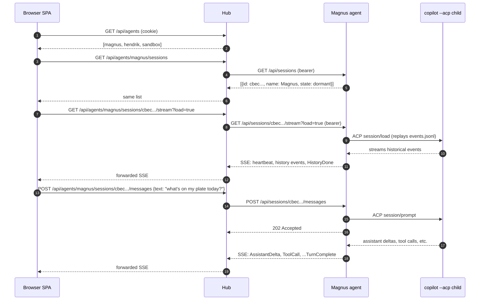
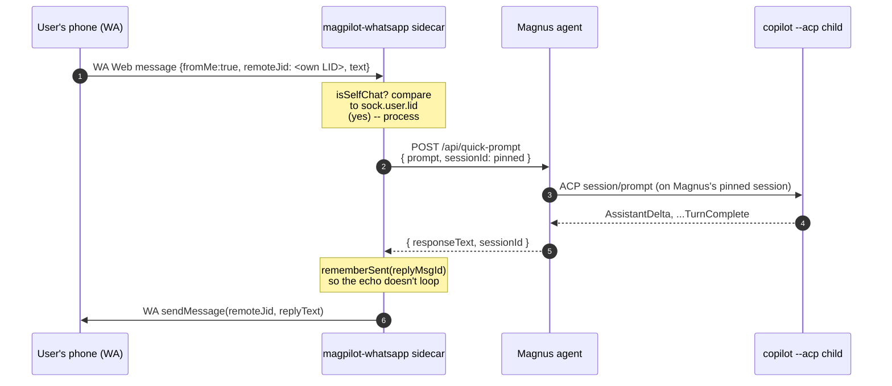
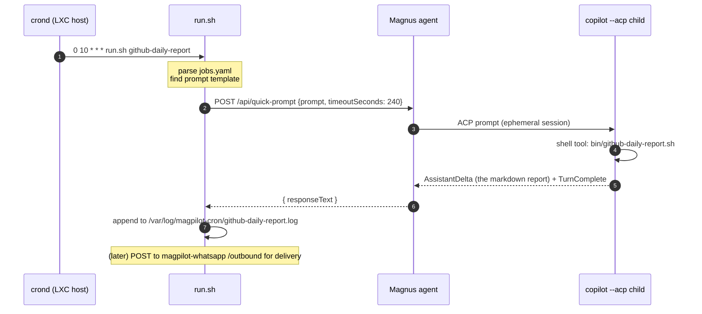

# Magpilot Architecture

> A guided tour of how Magpilot is put together: what each process does, how
> they find each other, how a single user prompt flows through the system,
> and how external sidecars (WhatsApp, cron, Preflight) plug in without the
> hub or agents having to know about them.

## At a glance

```
                        BROWSER / PHONE
                              |
                              | HTTPS (cookie auth)
                              v
                       +---------------+
                       |  Magpilot Hub |     <-- the only thing exposed to NPM/the LAN
                       |  (ASP.NET 9)  |
                       +---------------+
                          ^         ^
                 hub<->agent       hub<->agent
                  HTTP+SSE          HTTP+SSE
        (agent bearer auth)     (agent bearer auth)
                       |        |        |
              +--------+        |        +-----------+
              |                 |                    |
    +-------------------+ +-------------------+ +-------------------+
    | HENDRIK agent     | | SANDBOX agent     | | Magnus agent      |
    | (Win, dev box)    | | (Win VM)          | | (LXC 102, Linux)  |
    | spawns copilot.exe| | spawns copilot.exe| | spawns copilot    |
    | (and agency.exe)  | | (default flavor)  | | (always-on        |
    |                   | |                   | |  pinned session)  |
    +-------------------+ +-------------------+ +-------------------+
              ^                                          ^
              |                                          |
        UDP discovery                                    | direct HTTP
        broadcast 47823                                  | (agent bearer)
                                                         |
                                            +------------+------------+
                                            |                         |
                                  +-------------------+   +-------------------+
                                  | magpilot-cron     |   | magpilot-whatsapp |
                                  | (host crond +     |   | (Node + Baileys   |
                                  |  bash script)     |   |  + Fastify)       |
                                  +-------------------+   +-------------------+
                                                                  ^
                                                                  | WA Web protocol
                                                                  | (Signal-style E2EE)
                                                                  v
                                                              WHATSAPP
```

Key shapes to keep in mind:

- **One Hub, many Agents.** The hub doesn't run Copilot — agents do. The hub
  is the user-facing front door (browser SPA, REST/SSE, identity).
- **Sidecars talk to the agent's HTTP API directly.** They don't reach into
  the hub, and they aren't known to the hub. (Cron and WhatsApp both live on
  LXC 102 next to Magnus, so "talk directly to :5099" means localhost.)
- **The SPA is the only client that goes through the hub** for per-agent
  data. Service callers (cron, WA) bypass the hub by talking to a specific
  agent they were configured for.

## The processes, in detail

### Magpilot Hub (`Magpilot.Hub`)

ASP.NET 9 Web app. Single container at `/srv/magpilot/`, host networking,
port 7088 behind Nginx Proxy Manager (`magpilot.home.sienkiewi.cz`).

Responsibilities:

- Serves the **Blazor WebAssembly SPA** (the wwwroot is built into the hub
  image at compile time -- no separate static-host needed).
- Holds the **agent registry**: known per-host agents with their URL,
  bearer token, capability flavors, enrollment lineage, and
  last-heartbeat timestamp. SQLite-backed (`hub.db`) so it survives a
  hub restart; the UDP discovery sweep refreshes URL + flavors for
  reachable LAN agents on each pass.
- Performs **agent discovery** every N seconds: broadcasts a UDP probe on
  port 47823. Online agents reply with `{name, url, flavors}`. A
  WireGuard-only host (e.g. Sandbox on a `/32`) never receives the
  broadcast, so its URL and flavors are seeded once in `hub.db` and
  persist across restarts + re-pairs.
- **Proxies** SPA-initiated calls to the right agent: browser hits
  `https://magpilot.../api/agents/magnus/sessions`, hub looks up `magnus`
  in the registry, forwards the call with the agent bearer token.
- **Three named HttpClients per agent** (`agent`, `agent-action`,
  `agent-stream`) registered in `Program.cs` and dispensed by
  `AgentHttpClient.ClientFor(name, kind)`:

  | Kind                       | Timeout       | Used for                                                                                        |
  |----------------------------|---------------|-------------------------------------------------------------------------------------------------|
  | `AgentClientKind.Read`     | 10s (default) | Control-plane GETs (registry, sessions list, host state). Fail-fast so a dead agent can't stall SPA aggregation. |
  | `AgentClientKind.Action`   | 90s (default) | ACP-driving mutations: `POST /sessions`, `POST /sessions/{id}/adopt`, `/acquire-for-host`, `/release`. ACP can spend ~5-30s loading plugins or replaying a large session on `session/load`; under 10s the hub returned 502 and marked the agent OFFLINE despite it being healthy. Rule: any proxy that drives `session/load` / `session/new` / a turn-boundary wait belongs here, not on `Read`. |
  | `AgentClientKind.Stream`   | infinite      | SSE proxy + `quick-prompt` (long-poll service caller).                                          |

  Tunable via `Hub:AgentHttpTimeoutSec` and `Hub:AgentActionTimeoutSec`.
  **Regression rule:** any new mutating endpoint must request `Action`;
  fire-and-forget routes like `/messages` (which return 202 immediately)
  can stay on `Read`.
- **OAuth** for browser users (GitHub OAuth, allowlisted username; or
  `MAGPILOT_DEV_BYPASS_AUTH=true` for `/dev-login`). Cookie auth.

The hub does **not** know about cron jobs, WhatsApp, or Preflight. Those
are external clients of the agent API.

### Magpilot Agent (`Magpilot.Agent`)

ASP.NET 9 Web app, one per host (HENDRIK, SANDBOX, Magnus). Listens on
TCP 5099 + UDP 47823.

Responsibilities:

- Owns the active **session runtime** behind
  `IAgentSessionRuntime`. The production implementation is currently the ACP
  manager, which owns `copilot --acp` child process(es) (Linux
  binary or `copilot.exe`), optionally `agency.exe` for the agency flavor
  on Windows hosts.
- Maintains **sessions**: maps a Magpilot session id to a runtime session id
  and a CWD. State persists in `~/.copilot/session-state/` (events.jsonl
  per session). Adopts dormant sessions on demand when the SPA opens one.
- Serves the **agent HTTP API** (see below). Bearer-auth protected
  with `MAGPILOT_AGENT_TOKEN` (shared secret with the hub).
- Replies to UDP discovery probes with name + URL + flavors.

The HTTP endpoints, session registry, cooperative handoff, and turn watchdog
depend only on `IAgentSessionRuntime`. `SessionRuntimeProfile` carries the
complete generic configuration needed to create or restore a session.
`AcpSessionManager` implements the interface through a thin explicit adapter,
so this seam does not change runtime behavior. It exists so the public Copilot
SDK can be introduced and canaried without changing the hub or agent API.

The Agent also owns a lazy `SdkClientPool`. It uses the public .NET Copilot SDK
with `CopilotClientMode.CopilotCli` and the supported out-of-process stdio
transport. Clients are keyed by `CopilotHome`/SDK `BaseDirectory`; session
configuration is mapped separately. Merely starting Magpilot.Agent does not
start an SDK runtime, and no session routes through this pool yet.

The initial typed profile mapper deliberately rejects two profiles instead of
silently weakening them:

- Agency remains ACP-only until `agency copilot` exposes a compatible SDK
  runtime surface.
- `DisableBuiltinMcps` remains unsupported until disabling the SDK runtime's
  complete built-in MCP set is proven equivalent to the CLI switch.

SDK sessions use streaming mode. `SdkTurnEventMapper` translates typed
message/reasoning deltas and tool lifecycle events to the existing
`StreamEvent` wire records. It treats `session.idle` as the successful turn
boundary and emits one error plus one terminal boundary for a session error,
so the later idle event cannot double-complete callers.

`SdkPermissionBroker` connects the SDK permission callback to the current
`ApprovalRequired` SSE event and `/approvals/{approvalId}` endpoint. Automatic
approval is still controlled by the existing per-session yolo registry and
`MAGPILOT_AUTO_APPROVE`; managed-policy requests bypass auto-approval and
require a user. The SDK's .NET permission decision types are experimental, so
the diagnostic opt-in is scoped to this broker rather than project-wide.

The current runtime process does **not** speak to the LLM directly. It speaks
ACP (Agent Client Protocol -- a JSON-RPC-over-stdio protocol) to a child
`copilot` process, which in turn calls the GitHub Copilot API.

### Current runtime: Copilot CLI ACP child

Each agent spawns one (or more) long-running `copilot --acp` subprocesses.
ACP is a multi-session protocol -- one process can host many independent
conversations -- so the "default" flavor uses a single shared child.
"Agency" flavor on Windows spawns one child per session because agency's
session multiplexing isn't reliable.

A session create/adopt request may pin a **custom agent**, **model**, and
**reasoning effort** through ACP configuration. The custom-agent name is also a
process argument because Copilot 1.0.82 advertises its `_agent` selector only
when launched with `--agent <name>`. Other process-scoped settings
(`disableMcpServers`, `availableTools`, `disableBuiltinMcps`,
`noCustomInstructions`, and `copilotHome`) create a distinct ACP child.
`copilotHome` becomes that child's `COPILOT_HOME` environment variable; it
does not alter the daemon's own home.

After both `session/new` and `session/load`, the agent discovers the
agent/model/reasoning selectors from the returned ACP `configOptions` and calls
`session/set_config_option` for each requested value.
It uses advertised option ids and values rather than hard-coding CLI-specific
identifiers, lists advertised values when a request is unsupported, and fails
the HTTP request explicitly if an option/value is absent or the ACP response
does not confirm it. Agent is applied first because it can change model/tool
policy, followed by model and reasoning. If a later selection fails, earlier
confirmed selections are rolled back in reverse order before the failure is
returned. Magpilot stays generic: it exposes the knobs; each API consumer
chooses the concrete agent, tools, and config root. The complete process flavor
is retained during host handoff. Already-Owned adopts apply and verify
agent/model/reasoning against the latest config state; any in-place process
scope change fails explicitly.

Every attach/configure operation for a session is serialised on a per-session
gate. Process scope is always checked, while agent/model/reasoning are re-verified
against the newest config snapshot when the caller explicitly requested them
or a retained verified expectation exists. ACP `configOptions` is
optional, so an ordinary unpinned `session/new` or `session/load` with no such
expectation does not require a snapshot; explicit or retained pins remain
fail-closed. Two concurrent adopts can therefore neither interleave their
`set_config_option` calls nor leave the child on a combination nobody asked
for. prompts use that same gate, so no turn can run between the agent, model, and
reasoning updates. A session whose later `config_option_update` drifts from any
explicitly pinned dimension is immediately quarantined again. Shared-child
recycling also refuses while any co-hosted session is configuring, so
successful verification cannot race route invalidation. Its global routing
gate is released after the atomic idle check, client retirement, held-session
snapshot, and route invalidation -- before process disposal/replacement
initialization -- so unrelated children can keep accepting work while late
operations are rejected from the retired generation.
A session whose
configuration cannot be applied and verified is **quarantined rather than
detached**: copilot cannot unload a session, so dropping the route would only
make the retry's `session/load` answer "already loaded". The route and lock are
kept, registry ownership is withheld, and the session is refused for prompts
(409) until a later adopt re-applies and verifies its configuration in place.
A request rejected before anything is sent -- an unadvertised option or value,
or a caller cancellation before the first RPC -- leaves the last verified
configuration live and the session usable; only an actual unverified mutation
quarantines. An unverified configuration is never served.

The Copilot CLI authenticates with GitHub on its own (device flow, or
`COPILOT_GITHUB_TOKEN` env). It runs the conversations, calls tools,
writes/reads files, talks to MCP servers.

### Sidecars (cron, WhatsApp, Preflight)

Each sidecar is a separate process/container. They speak only to the
**agent HTTP API** (or, for Preflight, to the **hub HTTP API**). They are
stateless in terms of agent state -- the agent is still the single source
of truth for session state, cwd, ACP wiring, etc.

A sidecar plugs in by knowing:

1. The URL of the target agent (e.g. `http://127.0.0.1:5099` for things
   on LXC 102 next to Magnus).
2. The agent bearer token (`MAGPILOT_AGENT_TOKEN`).
3. (Optionally) a pinned session id, so calls accumulate context across
   invocations instead of starting a fresh conversation each time.

### Magpilot Host (`Magpilot.Host`, the launcher)

Console binary at `src/Magpilot.Host/`, assembly name `magpilot` (i.e.
ships as `magpilot.exe`). Installed on developer machines as
`magpilot` on PATH. **Does NOT shadow `copilot`** -- the user invokes
the launcher explicitly with `magpilot [args]`; the real `copilot`
binary stays as it is. The launcher:

1. Parses `--magpilot-*` flags (take, force, no-take, skip-check,
   no-tui-changes, the granular `tui-options` allowlist, exit-on-handoff,
   status, help) and strips them before forwarding.
2. Pings the agent. If unreachable, emits one warning and exec's the
   real `copilot` binary as a transparent passthrough.
3. Resolves the target session id from argv: a UUID inside
   `--resume=<UUID>` or `--session-id=<UUID>` is treated as known up
   front. For known sids, the launcher calls `GET /sessions/{id}/state`
   and prints an interactive Y/n/f/d take-over prompt when the session
   is currently agent-owned (auto-answered by `--magpilot-*` flags or
   refused on non-TTY). For everything else (`--resume="some name"`,
   `--resume=<id-prefix>`, `--continue`, picker mode, no args), the
   launcher takes the post-spawn detection path: spawn copilot in a
   PTY, then watch the on-disk session-state directory until it can
   identify which session copilot ended up holding, and only then
   register host ownership.
4. On accept (known-sid take-over path): `POST /acquire-for-host`,
   then spawns the real `copilot --resume=<sid>` inside a real PTY
   (via `Porta.Pty`). Bidirectional byte pump between the user's
   terminal (in raw mode) and the PTY master; window-resize watcher.
5. Subscribes to the session's SSE stream. On `release_requested`:
   writes `/exit\r` to the PTY master so copilot shuts down cleanly
   (3s grace, 1s on Force, then `PTY.Kill`), prints a banner, calls
   `POST /release`, and either exits (with `--magpilot-exit-on-handoff`)
   or sits on a "Press <enter> to take it back" prompt.
6. Before step 4's `acquire-for-host`, the launcher fires
   `release-request` itself (with a 500ms grace) so any SPA tab
   currently subscribed sees the SSE event and stops driving BEFORE
   ownership flips. Without this courtesy the SPA only learns about
   the takeover when its NEXT `/messages` POST returns 409.
7. On PTY paths, applies the configured terminal palette to the outer
   terminal. The same output pipeline can rewrite copilot's fixed
   composer-surface greys, faint reasoning text, and current Base-16-derived
   truecolor tokens when the theme configures `inputBand`, `thinking`, or
   `legacyDefaultColors`. Compatibility mode suppresses startup-banner
   injection because copilot's animated welcome card cannot account for text
   inserted after its layout pass. `--magpilot-no-tui-changes` bypasses the
   background probe, terminal-environment defaults and hints, palette changes,
   output rewrites, and banner injection. Coordinated sessions retain the PTY
   because ownership detection and graceful handoff depend on it; agentless
   passthrough direct-execs for parity with a raw `copilot` launch.
   `--magpilot-tui-options=<list>` independently gates `term`, `truecolor`,
   `background`, `github-theme`, `palette`, `thinking`, `input-band`,
   `legacy-colors`, and `banner`; `rewrite` enables the three rewrite stages
   as a group. `all` is the default and `none` is the explicit no-mutation
   state.

The launcher can characterize these stages without relying on screenshots:
`MAGPILOT_TERM_MANIFEST` records the resolved child hints and active stages,
while `MAGPILOT_TERM_DUMP`/`MAGPILOT_TERM_DUMP_POST` record pre/post-rewrite
ANSI. `MAGPILOT_TERM_DUMP_MS` ends capture after a fixed settling window while
Copilot keeps running. The manifest also records MSYS/shell/terminal markers
and .NET's stdin/stdout redirection view, because Git Bash and PowerShell are
different terminal-hosting experiments. `scripts/capture-tui-matrix.ps1`
generates the full hint matrix and isolated rendering cases;
`tools/tui-matrix/render.mjs` feeds each capture through `@xterm/headless` at
the recorded dimensions and writes normalized cell-style snapshots plus
row-level diffs against `none`.
`tools/tui-matrix` also contains an offline xterm.js theme lab. It replays
captured raw ANSI, applies the same palette/thinking/input-band/legacy
transformations as the launcher, maps clicked cells back to shared selectors,
and exports theme JSON. It deliberately does not host a live PTY.
The capture runner's `none` case is intentionally PTY-hosted so bytes can be
observed; it is not equivalent to the agentless direct-exec
`--magpilot-no-tui-changes` path. In Git Bash the direct path retains a richer
composer bar that none of the tested environment hints restores inside
ConPTY, identifying terminal hosting/capability negotiation as a separate
dimension from Magpilot's explicit TUI transformations.
`scripts/probe-terminal-paths.ps1` compares those hosting paths directly by
running the same Node probe outside and inside `PtyHost`, recording Node's
TTY/color-depth view, Win32 console modes after Node enters raw mode, and the
raw replies to Copilot's terminal queries.
Porta.Pty's app-local path matches direct Git Bash in the terminal probe: full
OSC palette/foreground/background replies, device attributes, mode reports,
TTY flags, dimensions, console modes, and code pages. Windows' in-box ConPTY
is retained only as a reduced-capability diagnostic control. `sch.pty.net`
must not return because its bundled January 2022 host predates
microsoft/terminal#17729.

`Magpilot.Host` moved to `net10.0` and `Porta.Pty` 2.2.2; the platform services
remain on `net9.0`. Porta.Pty keeps the same PTY API shape, supports Native AOT,
ships current out-of-band ConPTY assets, handles its startup DA1 handshake,
and provides a runtime in-box/out-of-band selector.

`MAGPILOT_CONPTY=app-local|system` maps to
`PORTAPTY_CONPTY=oob|inbox` before the first PTY spawn, allowing the same
launcher binary to compare app-local `OpenConsole.exe` with Windows'
`kernel32!CreatePseudoConsole`. App-local is the default and matches the outer
terminal; system remains a diagnostic fallback with reduced query behavior.

On Windows `PtyHost` enables Porta.Pty's async I/O path and treats child exit
and output completion as separate events. Disposal cancels input/resize work,
waits for the child, then drains PTY output through EOF before closing the
connection and restoring the parent terminal. This preserves Copilot's final
terminal-mode reset sequences; closing at `ProcessExited` leaves the returned
shell in application input mode.

All launcher-side diagnostics that fire while copilot is rendering
its TUI (SSE-subscribe failures, post-spawn detection timeouts,
acquire-for-host errors, release errors) are queued onto a
`ConcurrentQueue<string>` and flushed to stderr only after copilot
exits, so the launcher never writes mid-screen and corrupts the UI.

Single-owner invariant by construction: while the wrapper holds a
session, the agent's `/messages`/`/interrupt`/`/approvals` endpoints
return 409 to the SPA + WhatsApp + cron, so `events.jsonl` never forks.

**Native AOT.** The launcher is published Native AOT
(`<PublishAot>true</PublishAot>` in `Magpilot.Host.csproj`): a single
native `magpilot.exe` (~7 MB, no `coreclr.dll`/`deps.json`) that
cold-starts in roughly a third of the JIT time -- worthwhile because it
runs on every `magpilot` invocation. Porta.Pty's `conpty.dll` and matching
architecture-specific `OpenConsole.exe` hosts are copied physically beside
the exe. The one
constraint AOT imposes: **all launcher JSON goes through
source-generated contexts**, never reflection. `HostWebJsonContext`
(mirrors `JsonSerializerDefaults.Web`) covers the `System.Net.Http.Json`
calls to the agent/hub; `HostGeneralJsonContext` (General defaults)
covers the raw `StreamEvent` SSE reads and the UDP `DiscoveryReply`;
`EnrollmentBundleJsonContext` (in `Magpilot.Shared`) covers the
`magpilot2+` bundle codec. A reflection `JsonSerializer.Deserialize<T>`
or a `System.Net.Http.Json` call without a `JsonTypeInfo<T>` compiles
but throws `NotSupportedException` at runtime under AOT;
`HostJsonContractTests` pins the wire shapes so a naming-policy slip is
caught in CI rather than in the field.

Because application code is embedded in the Native AOT executable, local
launcher hotpatches must replace `magpilot.exe`; copying a managed
`magpilot.dll` beside it has no effect.

## Auth model

There are two unrelated auth boundaries:

```
+-----------+   GitHub OAuth   +-----+   bearer token   +-------+
| BROWSER   | ---------------> | HUB | ---------------> | AGENT |
| (cookies) |                  +-----+                  +-------+
+-----------+                                             ^
                                                          |
                                            +------------+
                                            |
                                      +-----------+   bearer token
                                      | SIDECARS  | -----------------+
                                      | (cron, WA)|                  |
                                      +-----------+                  |
                                                                     v
                                                                    AGENT
                                                                  (same one)
```

- **User -> Hub**: GitHub OAuth, username allowlist, cookie session.
  (Or `dev-login` shortcut if `MAGPILOT_DEV_BYPASS_AUTH=true`.)
- **Hub -> Agent**: shared bearer token `MAGPILOT_AGENT_TOKEN`.
- **Sidecar -> Agent**: same shared bearer token. Sidecars don't have a
  per-service token today; they get the same secret because they only run
  on hosts I trust (LXC 102).

Note: the Hub's `/api` endpoints **require browser cookie auth**. Service
callers can't talk to the hub. That's by design -- it forces sidecars to
declare which agent they target rather than punching through the hub.

### Multi-user agent ownership

The hub is multi-tenant across browser users. Every agent carries an
`owner_user` (the GitHub login that enrolled or adopted it), and the
hub scopes what each caller sees and can reach. Three caller shapes,
implemented as pure predicates in `Magpilot.Hub.Auth.AgentVisibility`
and enforced in one endpoint filter + the list handlers:

- **Infrastructure bearer** (`auth_kind = phone_bearer` --  preflight,
  sidecars, the MAUI app): a machine, not a person. Unscoped: sees and
  can reach every agent. Preflight enumerating hosts relies on this.
- **Admin browser user** (the first `OAUTH_ALLOWED_GITHUB_USERS` entry,
  `HubAuthOptions.AdminUser`): a superuser. Their *main* agent list
  (`GET /api/agents`) is still scoped to agents they own -- the
  day-to-day UI isn't cluttered with everyone's hosts -- but they get a
  dedicated cross-user view (`GET /api/admin/agents/all`) and can proxy
  to / manage any agent.
- **Regular browser user**: sees and can reach only the agents they own.

A `null` owner (rows enrolled before ownership existed, or
discovered-but-never-enrolled) is treated as the **admin's** in the
scoped list, so a deployment's pre-existing agents stay visible to the
primary user with no data migration -- and are unreachable by anyone
else.

Two distinct decisions:

| Decision | Predicate | Rule |
|---|---|---|
| Main-list membership | `ScopedToOwner(owner, login, isAdminLogin)` | owner matches, OR (owner is null AND caller is the admin login). The admin does NOT see foreign-owned agents here. |
| Proxy / management access | `CanAccess(owner, login, isAdmin)` | admin (infra bearer or admin login) reaches anything; everyone else only their own. |

Enforcement points:

- `GET /api/agents` -- infra sees all; a browser user gets the
  `ScopedToOwner` filter applied to `AgentRegistry.List()`.
- `GET /api/admin/agents/all` -- admin-only (403 otherwise), returns
  the full registry for the SPA's "Show all agents" toggle.
- A single **endpoint filter on the `/api` group** gates every route
  that carries an `{name}` agent segment (all the per-agent proxies,
  the SSE stream, `revoke`, `DELETE /agents/{name}`) with `CanAccess`;
  a non-accessible agent returns **404** (hides existence, not 403).
  This means the `Proxy` wrapper itself stays ownership-agnostic -- the
  gate lives in one place upstream of all ~17 call sites.
- `GET /api/me` reports `{ identity, isAdmin }` so the SPA can show the
  admin toggle.
- `GET /api/agents/version-status` and `POST
  /api/agents/check-updates` use the same scoped/all-agent rules.
  `all=true` is admin-only; regular users can inspect and signal only their
  own agents.

**Central logs are admin-only.** `GET /api/log` + `/api/log/sources`
(the viewer/query side) are gated to the admin -- they aggregate every
user's session activity. Ingest (`POST /api/log[/batch]`) stays open to
any authenticated producer (the SPA posts its own JS errors; agents
post via bearer). The SPA hides the Logs AppBar link for non-admins and
`/admin/logs` shows an "admin only" banner if reached directly.

**SPA nav:** the AppBar has an **Agents** link (all users -- everyone
needs `/admin/agents` to pair + manage their own hosts; the cross-user
"Show all agents" toggle inside is admin-only) and a **Logs** link
(admin only).

**UDP discovery is ownership-neutral.** Discovery is a hub-side,
unauthenticated LAN broadcast; it only refreshes an agent's
url/flavors/online-state and records a `null`-owner, `null`-token row
for any agent that answers. It never assigns or changes an owner --
ownership is set *exclusively* by the pairing flows (voucher redeem /
claim approve), and `AgentRegistry.Upsert` preserves an existing
`owner_user`. A discovered-but-unpaired agent is therefore admin-only
visible and unreachable by anyone (no token) until someone pairs it.
There is no per-user discovery.

> **Known multi-user seam (pairing claims are global).** Pending V3
> pairing claims (`GET /api/admin/agents/claims`) are visible to every
> authenticated user, and whoever clicks Adopt becomes the owner. A
> claim has no owner until adopted (the launcher initiates without
> knowing which hub user will claim it), so per-user claim scoping is a
> larger change deferred for now. Mitigations today: 5-min TTL, the
> fingerprint the launcher prints for visual verification, and re-pair
> to correct a mis-adoption. Low-stakes under a trusted-accounts
> allowlist.

Owner is stamped at enrollment: the voucher-redeem path uses the
voucher's `created_by_user`; the claim-approve path uses the adopter's
login (`decided_by_user`). A re-pair preserves an existing owner when
the new enrollment carries none (`COALESCE(excluded.owner_user, ...)`).


All routes are under `/api`, all protected by `Authorization: Bearer <MAGPILOT_AGENT_TOKEN>`
**except** the three read-only version endpoints (`/version`,
`/version/latest`, `/version/status`),
which are deliberately unauthenticated so the launcher's banner check
works without a configured token.

| Method | Path                                       | What it does                                              |
|---|---|---|
| GET    | `/version`                                 | Agent's own `{version, protocolVersion}`. **No auth.** Used by `magpilot --magpilot-version` and external probes. |
| GET    | `/version/latest?from=X.Y.Z`               | Hub-reported latest release metadata (cached locally by `UpdatePoller`). **No auth.** Recomputes `updateAvailable` against the requesting launcher's version, which may differ from the agent after a partial install. Drives the upgrade banner + `--magpilot-update`. |
| GET    | `/version/status`                          | Composite running/latest version, protocol range, update state, `lastCheckedAt`, and immediate-refresh capability. **No auth.** |
| POST   | `/version/refresh`                         | Authenticated hub signal: immediately poll `/api/agent-version`, update the local cache, and return the composite status. Does not install anything. |
| GET    | `/info`                                    | Agent name, OS, available flavors                          |
| GET    | `/sessions`                                | List sessions on disk (with state, cwd, last-touched)      |
| POST   | `/sessions`                                | Create a new session. Body `NewSessionRequest { Cwd?, Name?, InitialPrompt?, UseAgency?, Model?, ReasoningEffort?, DisableMcpServers?, Agent?, AvailableTools?, DisableBuiltinMcps?, NoCustomInstructions?, CopilotHome? }`. `Agent`/`Model`/`ReasoningEffort` pin advertised ACP session config options; all other added fields are process-scoped and select an isolated child. `Agent` also supplies the startup `--agent` needed for Copilot to advertise that selector. `AvailableTools` maps to `--available-tools=<selector>`, the booleans map to their CLI switches, and `CopilotHome` sets the child's `COPILOT_HOME`. **400** on an unsafe token/path; **502** if the CLI does not advertise/accept/confirm the requested config. |
| GET    | `/sessions/{id}`                           | Get session metadata                                       |
| GET    | `/sessions/{id}/state`                     | Rich ownership + activity view (see "Cooperative single-owner handoff" below). Returns `SessionStateInfo`. **NEW (shim Phase 1).** |
| POST   | `/sessions/{id}/adopt`                     | Bring a dormant session live (re-attach the ACP child). Body accepts the same optional session/process fields as create, with nullable process booleans so omission retains a recorded handoff flavor. Dormant sessions load with the requested process scope and config. Already-Owned sessions apply/verify agent/model/reasoning in place; a requested process-scope change fails explicitly because it requires another child. **502** if config cannot be applied exactly; **422** + `notLoadable` when the on-disk session has no `events.jsonl` and is not still resident in a live child. |
| POST   | `/sessions/{id}/detach[?force=true]`       | Detach without deleting on-disk state. `force=true` recycles the owning child when a prompt does not reach a cancellation boundary; co-hosted active turns veto the recycle. |
| POST   | `/sessions/{id}/messages`                  | Send a prompt; returns 202; SSE delivers the reply. **Returns 409** + `HostOwnedResponse` when a magpilot launcher holds the session (see handoff section), and **409** + `{ needsReadopt: true }` when the session is quarantined because its ACP config could not be verified. Body `PromptRequest { Text, Source? }` -- an optional `Source` (e.g. `assistant`, `whatsapp`) tags an out-of-band injection: the agent prefixes the prompt with `[via <source>]` for the brain and echoes a `UserDelta { Text, Source }` to subscribers so watchers see the question, not just the answer. |
| GET    | `/sessions/{id}/stream`                    | SSE stream of session events (deltas, tool calls, etc.)    |
| POST   | `/sessions/{id}/interrupt`                 | Cancel the in-flight turn. **Returns 409** when host-owned. |
| POST   | `/sessions/{id}/approvals/{approvalId}`    | Resolve an approval prompt. **Returns 409** when host-owned. |
| POST   | `/sessions/{id}/release-request`           | Broadcast `release_requested` SSE event to subscribers (e.g. a magpilot launcher) so they can begin graceful shutdown. **NEW (shim Phase 1).** |
| POST   | `/sessions/{id}/acquire-for-host`          | Atomic combined op: first drains prompt admission, then waits for a clean turn boundary (or aborts/recycles in-flight if `force=true`), drops its lock, records the session's complete flavor (process scope + agent/model/reasoning) and marks it host-owned. Refuses to overwrite another live host owner or a different live external holder (force must evict the latter first). **NEW (shim Phase 1).** |
| POST   | `/sessions/{id}/release`                   | Wrapper signals it has shut down its child; agent recycles the child still holding the session, reloads it from disk on the recorded flavor, and re-applies + verifies its agent/model/reasoning before claiming ownership. 409 if wrong `hostPid`. **NEW (shim Phase 1).** |
| POST   | `/sessions/{id}/yolo`                      | Flip the per-session yolo (auto-approve) bit. Body `YoloRequest { Enabled }`. Returns refreshed `SessionStateInfo` (the new bit is on `Info.Yolo`). **Returns 403** with `{ hostDisabled: true }` if the agent has `MAGPILOT_YOLO_DISABLED=true`. |
| POST   | `/quick-prompt`                            | Synchronous "ask + answer" -- handles SSE internally. Body also accepts an optional `Source` (same provenance semantics as `/messages`). |

### `quick-prompt` -- the convenience door for non-SPA clients

```
                     POST /api/quick-prompt
                     { prompt, [sessionId], [timeoutSeconds] }
   sidecar  ------------------------------------------------>  agent
                                                                  |
                                                              if sessionId:
                                                                adopt + use it
                                                              else:
                                                                create ephemeral
                                                                  |
                                                              subscribe to ACP
                                                                  |
                                                              send prompt
                                                                  |
                                                              accumulate deltas
                                                              until TurnComplete
                                                                  |
                                                              if ephemeral:
                                                                detach
   sidecar  <------------------------------------------------  agent
                  { responseText, stopReason, sessionId }
```

This is the API the WhatsApp sidecar and cron runner use. One HTTP call
in, the assistant's full reply text out. No SSE consumer code needed.

The optional `sessionId` field is the difference between "every WA
message is its own little fresh chat" (no sessionId) and "every WA
message goes into Magnus's pinned long-running conversation" (sessionId
pinned to Magnus's well-known session id).

## Sessions: ephemeral vs pinned

```
                 +------------+           +------------+
   create ----->|  CREATED   |---adopt-->|   ACTIVE   |---detach--+
                +------------+           +------------+           |
                                              ^   |               |
                                              |   | (copilot      |
                                          adopt   |  process      |
                                              |   v  exits/kills) |
                                          +------------+          |
                                          |  DORMANT   |<---------+
                                          | (events.   |
                                          |  jsonl on  |
                                          |  disk)     |
                                          +------------+
```

- **Ephemeral session**: created by `quick-prompt` without a `sessionId`,
  used for one turn, then detached. The `events.jsonl` stays on disk
  forever (you can later replay it in the SPA), but no live ACP subscription
  exists.
- **Pinned session**: a long-lived session you `/sessions/{id}/adopt` once
  and then keep using. This is what the SPA does for any session you
  explicitly open. Magnus has exactly one of these, created by his
  bootstrap script and recorded at `/home/magnus/.magnus/.session-id` so
  the bootstrap is idempotent across container restarts.

Magpilot's adopt-on-demand logic re-activates a dormant pinned session
lazily, but **only** through the endpoints that call `AdoptAsync`:
`POST /quick-prompt` (with a pinned `sessionId`), `POST /sessions/{id}/adopt`,
and `GET /stream?load=true`. **`POST /messages` and a plain `GET /stream`
do NOT adopt** -- they drive `session/prompt` on the ACP child directly and
assume the session is already loaded. Prompting a dormant session that way
fails silently: `session/prompt` errors, the turn ends `stopReason="error"`
with no assistant text. A client that pins a session must make sure it is
loaded first -- open it in the SPA, hit `/adopt`, or have the deployment's
bootstrap adopt it on every restart.

## End-to-end: what happens when you...

### ...open Magnus's session in the SPA


```mermaid
sequenceDiagram
    autonumber
    participant B as Browser SPA
    participant H as Hub
    participant A as Magnus agent
    participant C as copilot --acp child

    B->>H: GET /api/agents (cookie)
    H-->>B: [magnus, hendrik, sandbox]
    B->>H: GET /api/agents/magnus/sessions
    H->>A: GET /api/sessions (bearer)
    A-->>H: [{id: cbec..., name: Magnus, state: dormant}]
    H-->>B: same list

    B->>H: GET /api/agents/magnus/sessions/cbec.../stream?load=true
    H->>A: GET /api/sessions/cbec.../stream?load=true (bearer)
    A->>C: ACP session/load (replays events.jsonl)
    C-->>A: streams historical events
    A-->>H: SSE: heartbeat, history events, HistoryDone
    H-->>B: forwarded SSE

    B->>H: POST /api/agents/magnus/sessions/cbec.../messages {text: "what's on my plate today?"}
    H->>A: POST /api/sessions/cbec.../messages
    A->>C: ACP session/prompt
    A-->>H: 202 Accepted
    C-->>A: assistant deltas, tool calls, etc.
    A-->>H: SSE: AssistantDelta, ToolCall, ...TurnComplete
    H-->>B: forwarded SSE
```

### ...send a WhatsApp message


```mermaid
sequenceDiagram
    autonumber
    participant U as User's phone (WA)
    participant W as magpilot-whatsapp sidecar
    participant A as Magnus agent
    participant C as copilot --acp child

    U->>W: WA Web message {fromMe:true, remoteJid: <own LID>, text}
    Note over W: isSelfChat? compare<br/>to sock.user.lid<br/>(yes) -- process
    W->>A: POST /api/quick-prompt<br/>{ prompt, sessionId: pinned }
    A->>C: ACP session/prompt (on Magnus's pinned session)
    C-->>A: AssistantDelta, ...TurnComplete
    A-->>W: { responseText, sessionId }
    Note over W: rememberSent(replyMsgId)<br/>so the echo doesn't loop
    W->>U: WA sendMessage(remoteJid, replyText)
```

The crucial bit: with `sessionId` pinned, the WA conversation accumulates
in the same session you see in the SPA. Switch to the SPA, you see the
WA exchange. Reply in the SPA, the next WA message has that context.

### ...a cron job fires


```mermaid
sequenceDiagram
    autonumber
    participant K as crond (LXC host)
    participant R as run.sh
    participant A as Magnus agent
    participant C as copilot --acp child

    K->>R: 0 10 * * * run.sh github-daily-report
    Note over R: parse jobs.yaml<br/>find prompt template
    R->>A: POST /api/quick-prompt {prompt, timeoutSeconds: 240}
    A->>C: ACP prompt (ephemeral session)
    C->>C: shell tool: bin/github-daily-report.sh
    C-->>A: AssistantDelta (the markdown report) + TurnComplete
    A-->>R: { responseText }
    R->>R: append to /var/log/magpilot-cron/github-daily-report.log
    Note over R: (later) POST to magpilot-whatsapp /outbound for delivery
```

For now, cron jobs use ephemeral sessions so they don't pollute Magnus's
long-running conversation with morning report noise. Migrating to a
dedicated "cron context" session is a future option.

## Why this layout?

- **Sidecars don't know about each other.** WA, cron, Preflight are
  unaware. Magpilot has one public contract (the agent HTTP API) and
  every external integrator hits it the same way.
- **Hub stays small.** It's basically a registry + HTTP proxy + auth +
  the SPA host. All conversation/state logic is in agents.
- **Agents stay portable.** Same .NET binary runs on Windows (HENDRIK,
  SANDBOX) and Linux (Magnus). The only thing that changes per-host is
  what flavor of Copilot CLI is available (`agency.exe` is Windows-only).
- **Sessions are durable on disk.** Restart any process; conversations
  resume. The agent's adopt-on-demand logic means clients can ask for an
  old session at any time and it'll be brought back online.
- **No coupling to a particular client.** The SPA is one client. WA is
  another. Cron is another. A new client (e.g. a Discord bot, a slash
  command, a Slack relay) is just another process that POSTs to
  `/api/quick-prompt`.

## Multi-client coordination: SPA, WhatsApp, and the magpilot launcher

The session-state design originally assumed one Owner client at a time
(the SPA). Adding the WhatsApp sidecar as a second client of the same
pinned session, and later a magpilot launcher as a *terminal-side*
driver of the same pinned session, exposed three real edges. All three
are fixed; all three are worth understanding before you change either
end of the contract.

### Edge 1: history empty in SPA when WA loaded the session first

- ACP refuses to `session/load` a session that's already loaded.
- The SPA (when state == Owned) skips `load=true` to avoid that rejection
  and relies on the in-tab JS cache for history.
- A fresh tab with no cache + an Owned session = empty UI, even though
  `events.jsonl` on disk has full history.

**Fix in place**: the agent exposes `GET /api/sessions/{id}/history`
(`HistoryReader.cs`) which reads the session's `events.jsonl` directly
and projects it into a flat `List<{Role,Text,ToolCallId}>`. The SPA
falls back to that endpoint when state==Owned and there's no in-tab
cache, then connects to `/stream` without `load=true` for live updates.
ACP is bypassed entirely; the events file is the durable source of
truth that ACP itself was going to replay anyway.

### Edge 2: WA-side prompts not visible in SPA stream

- ACP only emits `user_message_chunk` during history *replay*
  (session/load), not during live prompts -- the prompt text IS the
  input.
- The SPA renders the user's typed prompt locally before submitting;
  nothing echoes it on the server side.
- A WA prompt sent via `/api/quick-prompt` with a pinned `sessionId`
  would cause Magnus to reply (visible in SPA via AssistantDelta), but
  the user's question never reached the SPA's stream.

**Fix in place**: agent's `quick-prompt` handler, when `sessionId` is
pinned, publishes a synthesized `UserDelta(req.Prompt)` into the
session's broadcast channel before dispatching to ACP. All other
subscribers (the SPA) see "the user said X" before the assistant
deltas arrive. Used `AcpSessionManager.PublishToSubscribers` (a thin

**Provenance generalization**: the same synthesized-`UserDelta` mechanism
carries an optional **`source`** on `/messages` (and `/quick-prompt`). When a
caller sets it -- e.g. the phone assistant relaying a question into the main
session with `source="assistant"` -- `PromptAsync` prefixes the model prompt
with `[via <source>]` (so the brain can disambiguate + tailor tone) AND publishes
a `UserDelta { Text, Source }`, so a persistent watcher (WhatsApp's coherent
stream) or the SPA sees the out-of-band question tagged, not just the answer.
Sourceless sends (the SPA's own) skip the synthesis so they don't double-render
against the SPA's local echo.
wrapper over the existing private Publish).

### Edge 3: phone or SPA wants to drive a session a terminal owns

The earlier "edges" both assumed the agent was always the driver. The
shim project (`copilot-context/ideas/projects/magpilot-shim.md`)
introduces a third class of client: a `magpilot` wrapper running
in the user's terminal. When the user runs `copilot --resume=<sid>`
(PATH-installed as `magpilot`), the wrapper takes ownership of the
session for an interactive terminal turn. While it's holding the
session, the agent must NOT silently drive the same session from the
SPA or WhatsApp, because that would fork `events.jsonl` (we proved it
empirically -- both VS Code's "connect" feature and concurrent
`copilot --resume` instances will fork the parentId chain because no
one re-reads the file before writing).

**Fix in place** (the cooperative single-owner handoff):

1. Agent's `Sessions/HostOwnership.cs` keeps an in-memory
   authoritative map of `sessionId -> hostPid`, mirrored to
   `~/.copilot/magpilot/hostownership.json` and reloaded (with a
   live-holder + start-time revalidation) on startup so an agent
   restart doesn't orphan the sessions a launcher is still driving.
   `Sessions/HostOwnershipReconciler.cs` additionally rebuilds the
   map from live process ancestry (`ProcessAncestry`, a Toolhelp
   snapshot): any live foreign lock whose holder is a descendant of
   a `magpilot` launcher is re-marked Host-owned, recovering sessions
   the persisted map never recorded. The launcher's own
   `release_requested` subscription reconnects with backoff across
   agent restarts (`SubscribeWithReconnectAsync`, over a dedicated
   infinite-timeout `AgentClient._streamHttp` so the reconnect's header
   fetch survives Kestrel's ~45s cold start) so the handoff stays
   cooperative rather than degrading to a force kill. Regardless,
   agent-side eviction in `ReleaseFromHostAsync` is the hard guarantee
   if that subscription is ever missing (old launcher) or wedged.
   The on-disk `inuse.<PID>.lock` files are advisory only -- two
   PIDs can claim the same session simultaneously and the file
   system does nothing to prevent it. (Verified empirically
   2026-05-13.)
2. `POST /api/sessions/{id}/acquire-for-host { HostPid, Force }`
   atomically waits for any in-flight ACP turn to reach a clean
   boundary. With `force=true` it sends cancel, gives the turn a 2s
   grace, then recycles the owning ACP child if the turn still has not
   stopped; an active co-hosted turn vetoes that destructive recycle.
   Only after the old writer is gone does it drop the agent's ownership
   and record the host as owner. Returns the refreshed `SessionStateInfo`.
3. While host-owned, **`POST /messages`, `POST /interrupt`, and
   `POST /approvals/{id}` return `409 Conflict`** with body
   `HostOwnedResponse { Error, NeedsRelease=true, HostPid }`.
   Callers (SPA's `HubClient.SendPromptAsync` and the WhatsApp
   sidecar's `postPromptWithReleaseKnock`) react to 409 by:
   - POSTing `/release-request { Requester, Force }` so the agent
     broadcasts a `release_requested` SSE event the wrapper is
     subscribed to.
   - Polling `GET /state` every 500ms until `owner != "Host"` or
     60s elapses.
   - Retrying the original POST.
4. The wrapper, on receiving `release_requested`, writes `/exit\r`
   to the PTY master so copilot's TUI exits cleanly (3s grace, 1s
   on Force, then `PTY.Kill`), prints a "─── web took over ───"
   banner, and POSTs `/release { HostPid }` so the agent re-adopts
   the session.
5. The wrapper either exits (with `--magpilot-exit-on-handoff`) or
   sits on a "Press <enter> to take it back" prompt with a 10-min
   timeout. Pressing enter fires `release-request` (500ms grace)
   BEFORE re-acquiring, exactly like the initial spawn paths, so a
   SPA tab that took the session over sees the live "terminal took
   over" banner instead of only finding out on its next 409 / refresh.
6. The agent's `DetachAsync` (called from `acquire-for-host` step 2
   above) deletes session locks written by its own ACP process tree. On Linux
   the platform-binary grandchild, not the spawned Node shim, writes
   `inuse.<pid>.lock`; descendant matching removes that lock while preserving
   live foreign holders. Without this cleanup, the new copilot prints a
   "session is already in use by another process" warning and the
   on-disk state ends up in the multi-lock advisory mode documented
   in the SessionScanner gotchas. `acquire-for-host` also snapshots the
   session's effective flavor -- process/tool/config-home scope plus the
   agent, model, and reasoning the ACP child last confirmed -- into the (persisted)
   host-ownership entry while holding the same per-session gate that excludes
   concurrent configuration, and the agent remembers which child still has
   the session resident even after the detach.
7. `release` re-attaches with that recorded flavor rather than the
   default. Because copilot implements neither `session/close` nor a
   disk re-read for an already-loaded session, the child still holding
   the session is recycled first, so the reload genuinely picks up what
   the terminal wrote; the agent/model/reasoning are then re-applied and
   verified. The session is only marked agent-owned, and host ownership only
   cleared, once load plus full configuration verification succeeds. A failure
   after load retains a quarantined route and the recorded handback flavor so a
   later release/adopt can retry configuration in place without another
   `session/load`. An entry written by an older agent (no recorded flavor)
   simply falls back to the default flavor as before.

**SPA-side reactivity** (the inverse direction -- something else
takes the session, the SPA notices): the SPA's `Apply()` reacts to
`release_requested` by stopping its stream + raising a "host took
over" MudAlert with a "Take back" button. Even before any takeover,
`OnParametersSetAsync` calls `GetStateAsync` after the session-list
fetch and skips streaming entirely if `Owner=Host`. The "Take back"
flow is **graceful-first**: `release-request(force=false)` then poll
`GetStateAsync` (up to ~30s, early-exit) waiting for the launcher to
hand off ON ITS OWN -- tear down its copilot (leaving the terminal on
its "resume here" prompt) and call `release` itself. The SPA does NOT
force-evict here. Only if that window elapses with the terminal still
holding the session does the SPA offer a **"Force take over"** button,
which runs the destructive dance: `release-request(force=true)` + 1s
grace + `acquire-for-host(0, force=true)` + `release(0, force=true)`.
Both `acquire-for-host` and `release` ride the hub's `Action` (90s)
client, not `Read` (10s): `release` re-adopts via `session/load`, which
can exceed 10s and would otherwise surface as `Take back failed: 502`
even against a healthy agent. **Agent-side eviction is gated on the
`Force` flag** (`ReleaseFromHostAsync`): a graceful release never kills
the terminal (it declines to adopt if a live foreign holder remains and
retains `Owner=Host` for retry); a forceful release evicts the still-live
foreign copilot (reaping its advisory lock) and then adopts. The agent
only ever kills a genuinely foreign holder, never its own ACP child,
and NEVER adopts while a live foreign holder remains (two live drivers
on one `events.jsonl` is the "garbled then stalled" split-brain).
**SPA guard**: the poll treats `Host`/`External` as "not free" and
re-raises the takeover choice ("Try again" / "Force take over") instead
of streaming into the duplication. Close-then-reopen resumes without
loss since sessions persist to disk. (Force-evicting kills the terminal
copilot as an external exit, so the launcher exits WITHOUT its resume
prompt -- acceptable on an explicit force, which is why it is no longer
the default take-back behaviour.)

**End-to-end timing**: a measured-typical 409 -> release-request ->
SSE -> wrapper exit -> retry -> 202 dance completes in ~3.4s.

**SPA UX on 60s timeout**: `HubClient.SendPromptAsync` throws
`HostStillOwnedException`. `Home.razor`'s `HandleSend` catches it and
surfaces a `MudAlert` with a "Take over from terminal" button that
calls `acquire-for-host` with `force=true`, immediately releases, and
retries the prompt.

**WhatsApp UX on 60s timeout**: a permanent WA chat message
"❌ Terminal session (PID N) did not release within 60s. Your message
was not delivered." (Force-take from WA isn't supported -- the user
must come to the SPA for that.)

> **If you add a new caller of `/messages` (or anything that drives
> ACP), wrap it with the same retry-on-409 pattern.** Don't
> re-implement ad hoc.

## How to add a new sidecar

1. Pick the agent you want it to talk to (probably Magnus, since he's
   always-on with persistent memory).
2. Get the agent token (`/srv/magpilot/.env` on LXC 102).
3. Optionally pin to Magnus's session id (`/srv/magpilot-agent/home/.magnus/.session-id`)
   if your sidecar should accumulate context across invocations.
4. POST your prompts at `http://127.0.0.1:5099/api/quick-prompt` (if
   on LXC) or the agent's LAN IP otherwise.
5. Run as a separate container in `/srv/<your-sidecar>/` with its own
   compose stack.

You don't need to register with the hub, modify hub code, or coordinate
with other sidecars. Magpilot doesn't need to know you exist.

## File / directory map (LXC 102 specifically)

```
/srv/
  magpilot/                <- the hub
    docker-compose.yml
    .env                   <- MAGPILOT_AGENT_TOKEN, MAGPILOT_HUB_TRUSTED_PROXIES
    data/                  <- hub state (small)
  magpilot-agent/          <- Magnus
    docker-compose.yml
    .env                   <- MAGPILOT_AGENT_TOKEN, COPILOT_GITHUB_TOKEN
    home/                  <- bind-mounted to /home/magnus inside container
      .copilot/            <- skills, mcp-config.json, copilot-instructions.md
      .magnus/.session-id  <- the well-known pinned session id
      magnus/              <- MEMORY/SOUL/IDENTITY + ported scripts (todo.py etc)
      bin/                 <- gh, github-daily-report.sh
      copilot-context/     <- task-context contents
  magpilot-whatsapp/       <- WA sidecar (now in chsienki/magstronaut)
    docker-compose.yml
    .env                   <- MAGPILOT_AGENT_TOKEN, WA_ALLOWLIST, OUTBOUND_TOKEN
    auth/                  <- Baileys persistent auth state (don't lose this)
  magpilot-cron/           <- cron sidecar (now in chsienki/magstronaut)
    run.sh
    jobs.yaml
  openclaw/                <- the legacy assistant, still running in parallel
    docker-compose.yml
    .env
    home/                  <- /home/node mount, contains everything OpenClaw needs

/etc/cron.d/
  magpilot-cron            <- crontab snippet calling /srv/magpilot-cron/run.sh
```

The Linux agent container comes from the generic public package
`ghcr.io/chsienki/magpilot-agent`. Magpilot owns publishing that platform
image; the outer deployment owns the selected tag, credentials, bootstrap
hooks, and bind-mounted home. Main builds publish only `:main` and
`:main-<short-sha>`; version tags publish the version tags and advance
`:latest`. This keeps untagged platform work from automatically restarting a
production agent.

> **Note** -- the `magpilot-whatsapp/` and `magpilot-cron/` directories on
> the LXC are deployed from
> [chsienki/magstronaut](https://github.com/chsienki/magstronaut), not from
> magpilot itself. Magpilot is a generic platform; site-specific sidecars
> live in the outer-ring repo. See magstronaut's `docs/ecosystem.md`.

## Glossary

- **ACP** -- Agent Client Protocol. JSON-RPC-over-stdio between the agent
  process and the Copilot CLI child. One ACP child can host many sessions.
- **Flavor** -- which kind of Copilot child to spawn. `default` is plain
  `copilot --acp`. `agency` is `agency.exe copilot ... --acp` (Windows
  only, Microsoft-internal MCPs). The agent picks a flavor per session via
  the `useAgency` field on `POST /api/sessions`; the **launcher** offers the
  same wrapping for interactive terminal sessions via `--magpilot-agency`
  (`agency copilot <args>` -- agency routes its own flags and passes the
  rest through to copilot; default MCPs on, no `--acp`).
- **Pinned session** -- a long-lived session that survives many
  conversations and many restarts. Created once, adopted on each restart.
- **Adopt** -- bring a dormant session back online by respawning ACP wiring
  and replaying events.
- **MEMORY.md / SOUL.md / IDENTITY.md** -- convention from OpenClaw,
  carried into Magnus. Knowledge files in `~/magnus/` that the model reads
  at session start and updates before /compact.

## UI / SPA

The Magpilot SPA is a Blazor WebAssembly app served by the hub. As of
2026-05-07 it uses **MudBlazor 9.4** as its design-system foundation.

- **Theme**: `Magpilot.UI/MagpilotTheme.cs` defines a single `MudTheme`
  with light + dark `Palette` variants. Brand colours: deep midnight blue
  primary (matching the magpie's plumage), iridescent teal/violet accents
  for success/secondary highlights. Inter is the typography stack.
- **Mode**: defaults to light. The AppBar carries a sun/moon
  `MudIconButton` toggle; the user's choice is persisted to
  `localStorage["magpilot.darkMode"]`. Toggle propagates from the AppBar
  (in `Home.razor`) to `MainLayout` via a cascading `ThemeState` record
  (`Magpilot.UI/ThemeState.cs`) -- this avoids a circular reference
  between `Magpilot.UI` (RCL) and `Magpilot.Web` (the WASM project).
- **Layout**: `MudLayout` with `MudAppBar` (selected host chip + dark
  toggle + cloud-status icon -- the AppBar is intentionally text-first;
  the magpie used to live here but was moved out during the brand
  sweep) and a `MudDrawer` that becomes off-canvas at viewports below
  `Breakpoint.Md`. Drawer holds a **two-pane** affair: the host picker
  (`MudList` with online dot) OR the grouped session list for the
  picked host (`MudListSubheader` per state, `MudChip` for state,
  "Show N more" button), with a back-arrow header to flip between
  them. The two panes are mutually exclusive within the drawer (not
  stacked sections).
- **Chat surface** (`Magpilot.UI/Components/ChatView.razor`): per-message
  `MudPaper` bubbles with role-aware avatars + alignment. User on the
  right with primary fill; assistant on the left outlined; thoughts in a
  dimmed italic card; tool calls as compact monospace `MudChip`. Approval
  prompts are a `MudAlert` Severity.Warning with action buttons. Magnus's
  thinking state is a 3-dot pulse animation. Composer is a real
  `<textarea>` (so the Enter/Shift+Enter shim in
  `Magpilot.Web/wwwroot/js/composer.js` still applies) paired with a
  `MudIconButton` paper-plane send.
- **Brand mark + MagpieMark component**: the magpie SVG lives in the
  shared RCL at `Magpilot.UI/wwwroot/favicon-mark.svg` (served via
  `_content/Magpilot.UI/favicon-mark.svg` to satellite SPAs). Inside
  C# components, render it via `Magpilot.UI/Components/MagpieMark.razor`
  -- a single source of truth with `Size` / `Glow` / `Class` parameters.
  Used on the agents-list bullets, the Hosts header, the no-agents
  empty state, and the loading-screen splash. Don't ship a local copy
  of the SVG to a consumer; the RCL one is canonical.
- **Brand-themed loader**: both SPAs (`Magpilot.Web/wwwroot/index.html`
  + `Magnus.Web/wwwroot/index.html` in the magstronaut repo) replace
  the default Blazor circle with a custom screen: the magpie mark
  centered behind a teal arc driven by `--blazor-load-percentage`.
  CSS lives in each app's `wwwroot/css/app.css`. Don't re-introduce
  the default Blazor circle SVG.
- **Take-over UX**: when `HubClient.SendPromptAsync` throws
  `HostStillOwnedException` (the agent returned 409 because a
  magpilot launcher holds the session and the polite knock didn't
  release within 60s), `Home.razor` surfaces a `MudAlert` above
  ChatView with a "Take over from terminal" button that calls
  `acquire-for-host?force=true`, immediately releases, and retries
  the prompt. See "Multi-client coordination" above.
- **Static JS**: lives in `Magpilot.Web/wwwroot/js/` (e.g. `composer.js`,
  `error-capture.js`) rather than collocated as `*.razor.js` next to
  components -- the hub's multi-stage Dockerfile trips BLAZOR106 on
  `_content/...` collocated assets at the second publish step.
